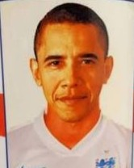

# Obama-Smaling Predictor
[日本語版](./README_ja.md)

## Background
Back in 2014, the Soccer World Cup was being held in Brazil. Of course, England, the mother country of football, participated in the tournament. 
Chris Smalling, a popular defender of the Manchester United, was one of the members of the English team.

On the other hand, a company aiming to take advantage of the special demand for the World Cup naturally produced goods of this popular player. Here it is.

[W杯おみやげ製造会社、スモーリングとオバマ大統領を間違えマグ2000個にプリント](https://www.soccer-king.jp/news/world/wc/20140624/204844.html)



It seems that they googled image for Smalling and commercialized a mug with the photo printed on it.
However, for some reason, they printed a picture of Barack Obama, the president of the United States at the time.
This ordinary mistake was widely reported by the Japanese football media, and I remember laughing at it.

Such a tragedy must never be repeated.
I felt a strong sense of mission and decided to implement the Obama-Smalling Predictor.

## Model
I implemented the model by using Keras.
```
model.summary()
_________________________________________________________________
Layer (type)                 Output Shape              Param #   
=================================================================
conv2d_1 (Conv2D)            (None, 148, 148, 32)      896       
_________________________________________________________________
max_pooling2d_1 (MaxPooling2 (None, 74, 74, 32)        0         
_________________________________________________________________
conv2d_2 (Conv2D)            (None, 72, 72, 64)        18496     
_________________________________________________________________
max_pooling2d_2 (MaxPooling2 (None, 36, 36, 64)        0         
_________________________________________________________________
conv2d_3 (Conv2D)            (None, 34, 34, 128)       73856     
_________________________________________________________________
max_pooling2d_3 (MaxPooling2 (None, 17, 17, 128)       0         
_________________________________________________________________
conv2d_4 (Conv2D)            (None, 15, 15, 128)       147584    
_________________________________________________________________
max_pooling2d_4 (MaxPooling2 (None, 7, 7, 128)         0         
_________________________________________________________________
flatten_1 (Flatten)          (None, 6272)              0         
_________________________________________________________________
dropout_1 (Dropout)          (None, 6272)              0         
_________________________________________________________________
dense_1 (Dense)              (None, 512)               3211776   
_________________________________________________________________
dense_2 (Dense)              (None, 1)                 513       
=================================================================
Total params: 3,453,121
Trainable params: 3,453,121
Non-trainable params: 0
_________________________________________________________________
```

For more detail, see [`work/`](./work/). Note that they are written in Japanese.

### Parameters
The parameters after learning were saved as [`model/obama_smalling_predictor.h5`](./model/).
