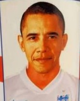

# オバマ/スモーリング判別器
## 背景
遡ること2014年、ブラジルでサッカーW杯が開催されていました。サッカーの母国イングランド代表チームも、もちろん出場しています。強豪マンチェスターユナイテッドでいじられキャラとして人気のDFクリス・スモーリング選手も、イングランド代表のメンバーの一人でした。
W杯特需を狙ったお土産製造会社は、当然のようにこの人気者のグッズを製作しました。それがこちら。

[W杯おみやげ製造会社、スモーリングとオバマ大統領を間違えマグ2000個にプリント](https://www.soccer-king.jp/news/world/wc/20140624/204844.html)



Google画像検索でスモーリング選手の検索し、それをプリントしたマグカップを商品化したようです。
しかし、なぜか当時のアメリカ大統領であるバラク・オバマの写真を印刷してしまいました。
この凡ミスは、当時日本のサッカーメディアでも多く取り上げられており、爆笑したのを覚えています。

## 概要
このような悲劇は、二度と繰り返されてはなりません。
私は強い使命感を覚え、スモーリング/オバマ判別器を実装することに決めたのでした。

### モデル
kerasで構築した以下のモデルを、学習させています。
```
model.summary()
_________________________________________________________________
Layer (type)                 Output Shape              Param #   
=================================================================
conv2d_1 (Conv2D)            (None, 148, 148, 32)      896       
_________________________________________________________________
max_pooling2d_1 (MaxPooling2 (None, 74, 74, 32)        0         
_________________________________________________________________
conv2d_2 (Conv2D)            (None, 72, 72, 64)        18496     
_________________________________________________________________
max_pooling2d_2 (MaxPooling2 (None, 36, 36, 64)        0         
_________________________________________________________________
conv2d_3 (Conv2D)            (None, 34, 34, 128)       73856     
_________________________________________________________________
max_pooling2d_3 (MaxPooling2 (None, 17, 17, 128)       0         
_________________________________________________________________
conv2d_4 (Conv2D)            (None, 15, 15, 128)       147584    
_________________________________________________________________
max_pooling2d_4 (MaxPooling2 (None, 7, 7, 128)         0         
_________________________________________________________________
flatten_1 (Flatten)          (None, 6272)              0         
_________________________________________________________________
dropout_1 (Dropout)          (None, 6272)              0         
_________________________________________________________________
dense_1 (Dense)              (None, 512)               3211776   
_________________________________________________________________
dense_2 (Dense)              (None, 1)                 513       
=================================================================
Total params: 3,453,121
Trainable params: 3,453,121
Non-trainable params: 0
_________________________________________________________________
```

### 学習後のパラメータ
学習後のパラメータは`model/obama_smalling_predictor.h5`として保存しました。
